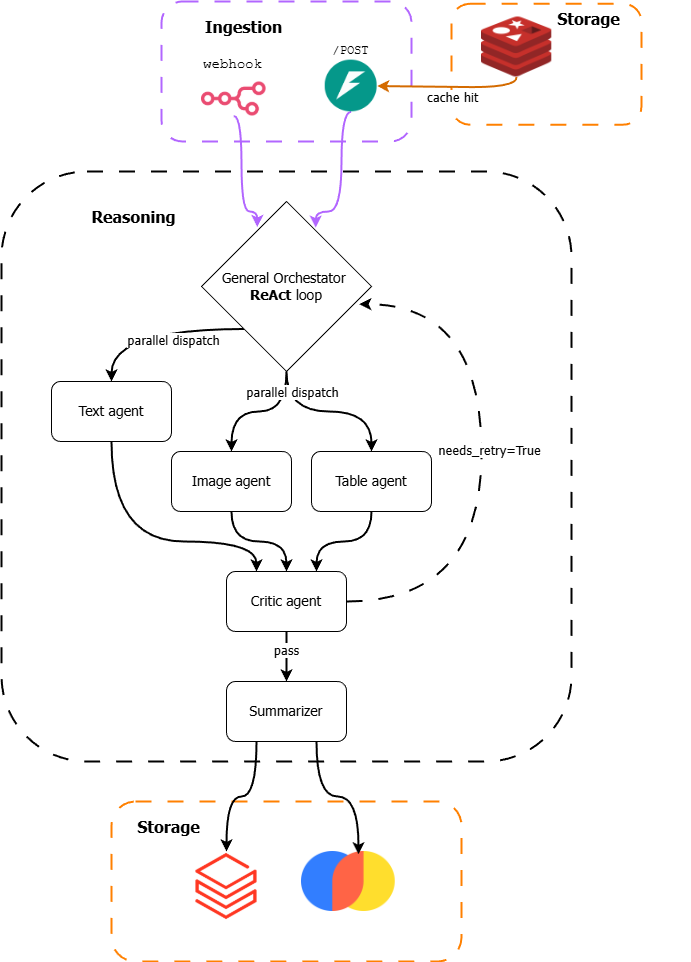

<p align="center">
  <h2 align="center">Madus (in development)</h2>
  <div>
    <p align="center">
      
    </p>
  </div>
  <p align="center">Multi-Modal Agentic Document Understanding System</p>
  <p align="center">
    
    
  </p>
</p>


MADUS is a production-oriented multi-agent framework for document question answering over complex PDFs containing text, figures, and tables. It adapts the research architecture of [MDocAgent](https://arxiv.org/abs/2503.13964) (Han et al., 2025) into a scalable, deployable system built on LangGraph, FastAPI, and Docker.


## Architecture

MADUS implements **Hierarchical Orchestration** over five specialized agents. A single General Orchestrator reasons over the full task using the ReAct loop (Yao et al., 2022), decomposes it into modality-specific subtasks, and dispatches them in parallel. Results converge at a Critic agent that implements the Reflexion pattern (Shinn et al., 2023) before a final Summarizer produces the answer.


<p align="center">
  
</p>


### Why Hierarchical Orchestration

In a flat multi-agent system every agent communicates with every other agent, producing $O(n^2)$ message complexity and fragile coordination. The hierarchical pattern reduces this to $O(n)$: the orchestrator is the single coordination point, agents are stateless workers, and the shared LangGraph state is the only communication channel. Adding a new modality agent means writing one node and one edge, not rethinking the coordination protocol.

The orchestrator is not a static router. It implements ReAct, meaning its routing decision at step $t$ conditions on the full trajectory:

$$c_t = \bigl(q,\; \tau_1, a_1, o_1,\; \tau_2, a_2, o_2,\; \ldots,\; \tau_t\bigr)$$

On a retry triggered by the critic, $c_t$ includes the verbal feedback $v_k$, so the orchestrator can selectively re-dispatch only the agent that failed rather than all three.

### Reflexion as a feedback gate

The Critic implements verbal reinforcement: rather than updating model weights, it produces a natural-language reflection $v_k$ that conditions the next attempt. For agent output $y_k$ at attempt $k$:

$$v_k = \text{Critic}(q,\; y_k^{\text{text}},\; y_k^{\text{image}},\; y_k^{\text{table}})$$
$$y_{k+1} = \text{Agent}(q,\; v_k,\; \text{context})$$

The retry loop is bounded at two iterations. If the answer is still insufficient after three total attempts, the Summarizer surfaces the critique alongside the best available answer.

### Retrieval

Text retrieval uses hybrid Reciprocal Rank Fusion over BM25 and dense semantic search:

$$\text{RRF}(d) = \sum_{r \in \{\text{BM25},\, \text{semantic}\}} \frac{1}{60 + \text{rank}_r(d)}$$

BM25 catches exact keyword matches that embeddings miss; semantic search catches paraphrase matches that BM25 misses. RRF fuses both ranked lists without requiring score calibration between rankers.


## API cost estimate (OpenAI backend)

Costs per cold run on a typical 20-page academic PDF with a single question. A cache hit on a repeated document costs $0.00.

| Agent | Model | Approx. tokens | Approx. cost |
|---|---|---|---|
| Orchestrator | gpt-4o-mini | 600 in / 100 out | $0.001 |
| Text agent | gpt-4o-mini | 2,000 in / 300 out | $0.003 |
| Image agent (2 images, low detail) | gpt-4o | 800 in / 300 out | $0.020 |
| Image agent (4 images, high detail) | gpt-4o | 3,000 in / 300 out | $0.060 |
| Table agent | gpt-4o-mini | 1,000 in / 300 out | $0.002 |
| Critic | gpt-4o-mini | 1,500 in / 200 out | $0.002 |
| Summarizer | gpt-4o-mini | 2,000 in / 400 out | $0.003 |
| Embeddings (index + query) | text-embedding-3-small | ~15,000 tokens | $0.001 |
| **Single cold run, low detail** | | | **~$0.032** |
| **Single cold run, high detail** | | | **~$0.072** |
| **Retry triggered (one extra pass)** | | | **+$0.025** |

Image agent cost dominates everything else. `detail: "high"` tiles each image into 512x512 crops at 170 tokens per tile, so four dense figures can exceed the combined cost of all other agents. Use `detail: "low"` (fixed 85 tokens per image) unless the question specifically requires reading fine-grained chart content.

**To run at zero cost** replace the two env vars:

```bash
LLM_BACKEND=local        # routes all agents through Ollama
EMBEDDING_BACKEND=local  # uses BAAI/bge-m3 via transformers, no API key needed
```

Requires `ollama pull llama3.2` and `ollama pull qwen2-vl:7b`. Tested on RTX 4060 8GB (each model fits in VRAM, loaded sequentially by Ollama).


## Quickstart

```bash
git clone https://github.com/youruser/madus && cd madus

cp .env.example .env          # add OPENAI_API_KEY or set LLM_BACKEND=local

docker compose up -d          # starts Redis, ChromaDB, n8n, API

curl -X POST http://localhost:8000/analyze \
  -F "file=@your_document.pdf" \
  -F "question=What is the main finding?"
```

n8n is available at `http://localhost:5678`. The default workflow watches a local folder and posts any dropped PDF to `/analyze`, pushing the result to a configured output (Slack, Google Sheets, etc.).


## Project structure

```
madus/
├── services/
│   ├── api/              FastAPI routes
│   ├── reasoning/        LangGraph graph, nodes, tools
│   └── extraction/       OCR, layout detection, table parsing
├── core/
│   ├── models.py         DocumentState schema (system contract)
│   ├── embeddings.py     OpenAI and local embedding backends
│   ├── cache.py          Redis SHA-256 content cache
│   └── config.py         LLM factory, env-based backend switching
├── configs/prompts/      Versioned prompt templates
├── tests/
│   ├── unit/             Extraction tests, no LLM
│   └── integration/      Full graph tests on real PDFs
└── docker-compose.yml
```


## References

- Han et al., MDocAgent (2025) — https://arxiv.org/abs/2503.13964
- Yao et al., ReAct (2022) — https://arxiv.org/abs/2210.03629
- Shinn et al., Reflexion (2023) — https://arxiv.org/abs/2303.11366
- Cormack et al., Reciprocal Rank Fusion (2009) — https://plg.uwaterloo.ca/~gvcormac/cormacksigir09-rrf.pdf
- Malkov & Yashunin, HNSW (2018) — https://arxiv.org/abs/1603.09320
- Faysse et al., ColPali (2024) — https://arxiv.org/abs/2407.01449
